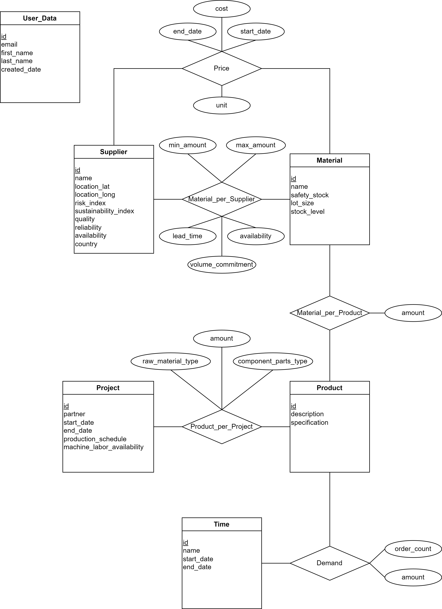

# Battery API Documentation

Currently launched on the vercel environment under the following link: https://batteryapi-phi.vercel.app/.

## Data Structure

## Endpoints

The Battery API offers a range of endpoints to facilitate interactions with user data, supplier information, pricing details, product management, project tracking, and test data generation. Each endpoint serves a specific purpose within the system, allowing integration and manipulation of data to meet diverse requirements. Below is a comprehensive list of endpoints categorized based on their respective functionalities. 

### User related

The User endpoint provides functionality for managing user data within the Battery API. Users can be retrieved, created, and deleted using respective HTTP methods.

* [Show User](documentation/user/get.md) : `GET /api/user/`
* [Create User](documentation/user/post.md) : `PUT /api/user/`
* [Delete User](documentation/user/delete.md) : `DELETE /api/user/`

### Supplier related

The Supplier endpoint enables the management of supplier information within the Battery API. Suppliers can be retrieved, created, and deleted using respective HTTP methods.

* [Show Supplier](documentation/user/get.md) : `GET /api/supplier/`
* [Create Supplier](documentation/user/post.md) : `PUT /api/supplier/`
* [Delete Supplier](documentation/user/delete.md) : `DELETE /api/supplier/`

### Price related

The Price endpoint offers functionality for managing pricing details within the Battery API. Prices can be retrieved, created, and deleted using respective HTTP methods.

* [Show Price](documentation/price/get.md) : `GET /api/price/`
* [Create Price](documentation/price/post.md) : `PUT /api/price/`
* [Delete Price](documentation/price/delete.md) : `DELETE /api/price/`

### Product related

The Product endpoint provides capabilities for managing product data within the Battery API. Products can be retrieved, created, and deleted using respective HTTP methods.

* [Show Product](documentation/product/get.md) : `GET /api/product/`
* [Create Product](documentation/product/post.md) : `PUT /api/product/`
* [Delete Product](documentation/product/delete.md) : `DELETE /api/product/`

### Project related

The Project endpoint facilitates the management of project information within the Battery API. Projects can be retrieved, created, and deleted using respective HTTP methods.

* [Show Project](documentation/project/get.md) : `GET /api/project/`
* [Create Project](documentation/project/post.md) : `PUT /api/project/`
* [Delete Project](documentation/project/delete.md) : `DELETE /api/project/`

### Test Data related

The Create Test Data endpoint generates random entries for test data within the Battery API. This endpoint aids in populating the system with simulated data, allowing for testing and development processes.

* [Create Test Data](documentation/createdata/get.md) : `GET /api/createdata/`

