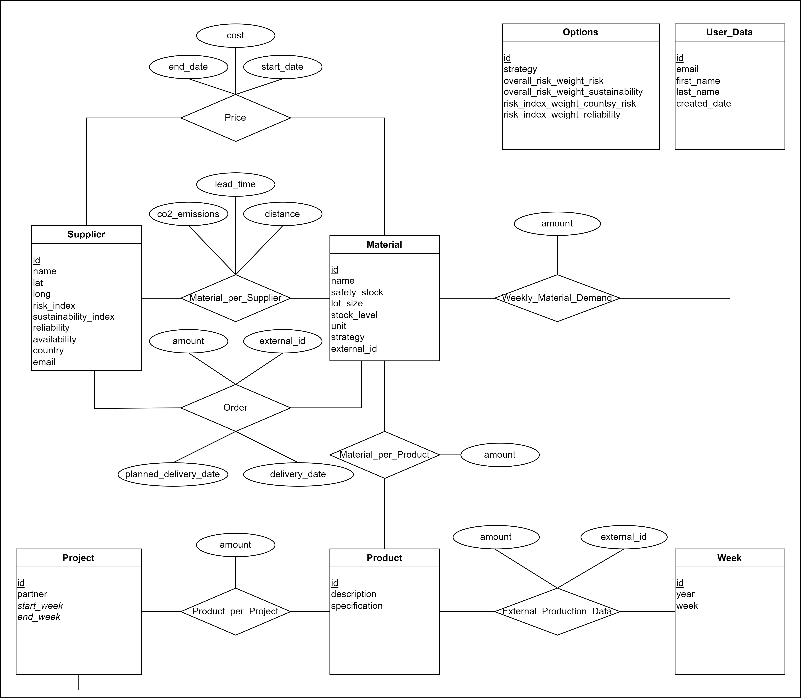

# Battery API Documentation

Currently launched on the vercel environment under the following link: https://batteryapi-phi.vercel.app/.

## Data Structure

* Suppliers provide various Materials. Each material has specific Prices that can vary over time and have different lead_times based on the supplier.
* Materials are used in Products, and the amount of material required is recorded in the Material_per_Product relationship.
* Projects involve the production of certain Products over specified time periods.
* Weekly_Material_Demand and Base_Production_Volume manage the weekly demand and the user defined production volumes for each week, respectively.
* Users and Options tables are used for managing user information and strategy options.

## Endpoints

The Battery API offers a range of endpoints to facilitate interactions with user data, supplier information, pricing details, product management, project tracking, and test data generation. Each endpoint serves a specific purpose within the system, allowing integration and manipulation of data to meet diverse requirements. Below is a comprehensive list of endpoints categorized based on their respective functionalities. 

### KPI related

Under this endpoint, all KPIs can be accessed and / or generated. The KPIs are Country-Risk, ... 

* [Show Country-Risk](documentation/kpi/countryrisk.md) `GET /api/kpi/countryrisk`
* [Show and Calculate Weekly Material Demand](documentation/kpi/weeklyDemand.md) `GET /api/kpi/weeklyDemand`
* [Show and Calculate Optimal Orders](documentation/kpi/optimalOrder.md) `GET /api/kpi/optimalOrders`
* [Calculate Supplier Reliability](documentation/kpi/reliability.md) `GET /api/kpi/reliability`

### Material related

The Material endpoint provides functionality for managing material data within the Battery API. Materials can be retrieved, created, and deleted using respective HTTP methods.

* [Show Material](documentation/material/get.md) : `GET /api/materials/`
* [Create Material](documentation/material/post.md) : `POST /api/materials/`
* [Delete Material](documentation/material/delete.md) : `DELETE /api/materials/`

### User related

The User endpoint provides functionality for managing user data within the Battery API. Users can be retrieved, created, and deleted using respective HTTP methods.

* [Show User](documentation/user/get.md) : `GET /api/user/`
* [Create User](documentation/user/post.md) : `POST /api/user/`
* [Delete User](documentation/user/delete.md) : `DELETE /api/user/`

### Supplier related

The Supplier endpoint enables the management of supplier information within the Battery API. Suppliers can be retrieved, created, and deleted using respective HTTP methods.

* [Show Supplier](documentation/supplier/get.md) : `GET /api/supplier/`
* [Create Supplier](documentation/supplier/post.md) : `POST /api/supplier/`
* [Delete Supplier](documentation/supplier/delete.md) : `DELETE /api/supplier/`

### Price related

The Price endpoint offers functionality for managing pricing details within the Battery API. Prices can be retrieved, created, and deleted using respective HTTP methods.

* [Show Price](documentation/price/get.md) : `GET /api/price/`
* [Create Price](documentation/price/post.md) : `POST /api/price/`
* [Delete Price](documentation/price/delete.md) : `DELETE /api/price/`

### Product related

The Product endpoint provides capabilities for managing product data within the Battery API. Products can be retrieved, created, and deleted using respective HTTP methods.

* [Show Product](documentation/product/get.md) : `GET /api/product/`
* [Create Product](documentation/product/post.md) : `POST /api/product/`
* [Delete Product](documentation/product/delete.md) : `DELETE /api/product/`

### Project related

The Project endpoint facilitates the management of project information within the Battery API. Projects can be retrieved, created, and deleted using respective HTTP methods.

* [Show Project](documentation/project/get.md) : `GET /api/project/`
* [Create Project](documentation/project/post.md) : `POST /api/project/`
* [Delete Project](documentation/project/delete.md) : `DELETE /api/project/`

### Base Production related

The Base Production endpoint allows for management of additional production plans to the projects. Base Production Data can be retrieved, created and deleted using respective HTTP methods.

* [Show Base Production](documentation/base_production/get.md) : `GET /api/baseproduction/`
* [Create Base Production](documentation/base_production/post.md) : `POST /api/baseproduction/`
* [Delete Base Production](documentation/base_production/delete.md) : `DELETE /api/baseproduction/`

### Order related

The Order endpoint allows for management of Historical and current. Order Data can be retrieved, created and deleted using respective HTTP methods.

* [Show Orders](documentation/order/get.md) : `GET /api/order/`
* [Create Orders](documentation/order/post.md) : `POST /api/order/`
* [Delete Order](documentation/order/delete.md) : `DELETE /api/order/`

### External Communication related

The Communication endpoints allow for emails to be sent out to suppliers including a link to the `update-form.html`, which then allows the supplier to enter necessary data themselves.

* [Send Email Link](documentation/external/generate_link.md) : `POST /api/external/generate_link/`
* [Update Supplier Data Form](documentation/external/update_data.md) : `POST,GET /api/external/generate_link/`