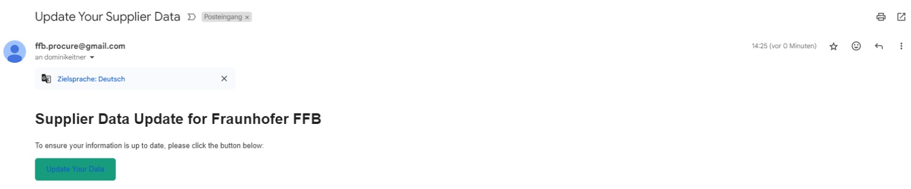

# Generate Link for Supplier Data Update

Generate a unique link for suppliers to update their data.

**URL** : `/api/external/generate_link/<int:supplier_id>`

**Method** : `POST`

**Data** :

```json
{

}
```

## Parameters

**supplier_id** (integer, required) - The ID of the supplier whose data needs to be updated.

## Success Response

**Code** : `200 OK`

**Content example**:`Link sent to example@email.com`

## Error Responses

**Code** : `404 Not Found`

**Content** : `Failed`

## Description

This endpoint generates a unique link for a specific supplier identified by their ID. The link is sent to the supplier's email address, given in the table `Supplier`, allowing them to update their data securely. Upon successful generation of the link, an email notification is sent to the supplier containing the link.



The link remains valid for a predefined period (default 7 days) from the time of generation. After the expiration, the link becomes invalid, ensuring data security and preventing unauthorized access.

The link directs the supplier to a dedicated update page where they can make necessary changes to their data, contributing to accurate and up-to-date supplier information within the system.